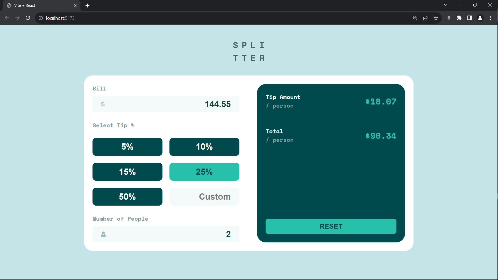

# Frontend Mentor - FAQ accordion card solution

This is a solution to the [Tip calculator app challenge on Frontend Mentor](https://www.frontendmentor.io/challenges/tip-calculator-app-ugJNGbJUX).

## Table of contents

- [Overview](#overview)
  - [The challenge](#the-challenge)
  - [Screenshot](#screenshot)
  - [Links](#links)
- [My process](#my-process)
  - [Built with](#built-with)
  - [What I learned](#what-i-learned)
- [Author](#author)

## Overview

### The challenge

Users should be able to:

- View the optimal layout for the app depending on their device's screen size
- See hover states for all interactive elements on the page
- Calculate the correct tip and total cost of the bill per person

### Screenshot

### Links

- Solution URL: [Link](https://github.com/TJ-Shubham/tip-calculator-app)
- Live Site URL: [Link]

## My process

### Built with

- [React]-18(https://reactjs.org/) & [Vite](https://vitejs.dev/guide/) - JS library
- CSS custom properties
- Flexbox
- Mobile-first workflow

### What I learned

Learn props, useState, useEffect and conditional rendering

## Author

- Frontend Mentor - [TJ-Shubham](https://www.frontendmentor.io/profile/TJ-Shubham)
